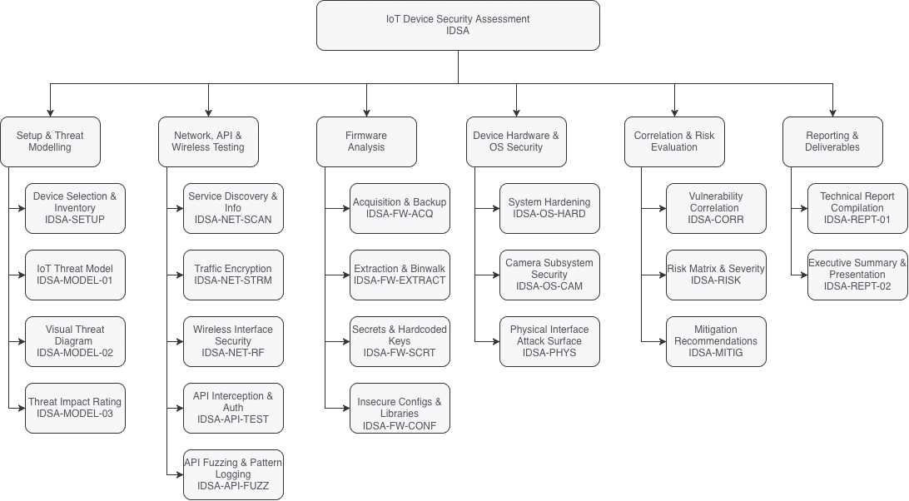

# IoT Device Security Assessment

This IoT Device Security Assessment project presents the design and development aimed at evaluating the security posture of consumer Internet of Things (IoT) devices across network, application, and firmware layers. Motivated by the rapid expansion of IoT ecosystems and the corresponding rise in security risks, the project applies an evidence-driven methodology inspired by industry standards such as the OWASP IoT Top 10 and NIST guidelines. The assessment framework guides the structured analysis of device behaviour, cloud interactions, and internal software components, ultimately enabling a comprehensive understanding of vulnerabilities and their implications.

## Table of Contents

1. [**Introduction**](./src/01_introduction/README.md)

2. [**IoT Security Testing Framework**](./src/02_framework/README.md)

   2.1. [IoT Device Model](./src/02_framework/device_model.md)

   2.2. [Threat Model](./src/02_framework/threat_model.md)

   2.3. [Testing Methodology](./src/02_framework/methodology.md)

3. [**Catalogue**](./src/03_catalogue/README.md)

   3.1. [Setup & Threat Modelling](./src/03_catalogue/setup_threat_modelling/README.md)

   3.2. [Network, API & Wireless Testing](./src/03_catalogue/network_api_wireless/README.md)

   3.3. [Firmware Analysis](./src/03_catalogue/firmware/README.md)

   3.4. [Device Hardware & OS Security](./src/03_catalogue/device_hardware_os/README.md)

   3.5. [Correlation & Risk Evaluation](./src/03_catalogue/correlation_risk/README.md)

   3.6. [Reporting & Deliverables](./src/03_catalogue/reporting_deliverables/README.md)

# Testing Checklist

The following is the list of items to test during the assessment:

`Status` column can be set for values similar to "Pass", "Fail", "N/A".

`Severity` column can be set for values "0-10" with 0 as the lowest to 10 being the highest potential magnitude of harm or damage if a risk event occurs (how bad). Refer to the [2.3. Testing Methodology](./src/02_framework/methodology.md) for specific CVSS rating.

## 3.1 Setup & Threat Modelling
| Test ID | Phase / Test Name | Status | Severity | Notes / Evidence |
| :--- | :--- | :--- | :--- | :--- |
| IDSA-SETUP-01 | Device Selection & Inventory (FR1, FR2) | | | Record device specs, hardware version, and identify exposed boot logs or hardware implementation details. |
| IDSA-MODEL-01 | IoT Threat Model (FR4, FR5) | | | Map all identified attack vectors (USB, Wi-Fi, Cloud API, Physical) to the threat model. |
| IDSA-MODEL-02 | Visual Threat Diagram (FR6) | | | Confirm diagram shows all attack surfaces including RPi, Blink App, and Cloud Endpoints. |
| IDSA-MODEL-03 | Threat Impact Rating (FR7) | | | Assign likelihood/impact scores to identified threats based on technical exploitability. |

## 3.2 Network, API & Wireless Testing
| Test ID | Phase / Test Name | Status | Severity | Notes / Evidence |
| :--- | :--- | :--- | :--- | :--- |
| IDSA-NET-SCAN-01 | Service Discovery & Info (FR3, FR12, FR13) | | | **Nmap:** Enumerate open ports, service versions, and OS fingerprints. Use **NSE scripts** to check for known CVEs on identified services. |
| IDSA-NET-STRM-01 | Traffic Encryption (FR8, FR9, FR10) | | | **Wireshark:** Verify WebRTC/Blink stream encryption. Monitor Wi-Fi for unencrypted PII; use **Foremost** to attempt image recovery from captured packets. |
| IDSA-NET-RF-01 | Wireless Interface Security (FR14) | | | **Wireshark:** Analyze WPA2/3 handshakes. Perform de-authentication tests to check if the camera fails insecurely or stops recording during jamming. |
| IDSA-API-TEST-01 | API Interception & Auth (FR15, FR16) | | | **Burp Suite:** Intercept App-to-Cloud calls. Test for **BOLA** (changing Device IDs), session hijacking, and credential harvesting/phishing risks in UI. |
| IDSA-API-FUZZ-01 | API Fuzzing & Pattern Logging (FR17, FR18) | | | Run fuzzing on endpoints; test Blink App login for **rate limiting** and brute-force resistance. |

## 3.3 Firmware Analysis
| Test ID | Phase / Test Name | Status | Severity | Notes / Evidence |
| :--- | :--- | :--- | :--- | :--- |
| IDSA-FW-ACQ-01 | Acquisition & Backup (FR19, FR21) | | | Verify firmware is saved; analyze Blink updates via App and capture RPi boot logs. |
| IDSA-FW-EXTRACT-01| Extraction & Binwalk (FR20) | | | Use **Binwalk** on RPi filesystem and EEPROM to extract files and identify disclosure of source code or binaries. |
| IDSA-FW-SCRT-01 | Secrets & Hardcoded Keys (FR22) | | | Search extracted files for hardcoded keys/passwords. Check `/etc/` and config files for unencrypted secrets and local Blink caches. |
| IDSA-FW-CONF-01 | Insecure Configs & Libraries (FR23) | | | Check `apt` packages on RPi for outdated software. Evaluate security of the update mechanism (Blink App vs. `sudo apt full-upgrade`). |

## 3.4 Device Hardware & OS Security
| Test ID | Phase / Test Name | Status | Severity | Notes / Evidence |
| :--- | :--- | :--- | :--- | :--- |
| IDSA-OS-HARD-01 | System Hardening (FR24) | | | Check RPi OS for default `pi` credentials and unnecessary services. Test Blink App UI for bypasses in lock screen or biometric auth. |
| IDSA-OS-CAM-01 | Camera Subsystem Security (FR25) | | | **OpenCV:** Attempt to hijack the stream via secondary scripts, inject pre-recorded video loops, and check `/dev/shm` or `/tmp` for leaked frames. |
| IDSA-PHYS-01 | Physical Interface Attack Surface (FR26) | | | **USB Testing:** Check if device mounts as storage/webcam; test for unauthorized serial shells; test if device can be spoofed as an **HID (Keyboard)** attack. |

## 3.5 Correlation & Risk Evaluation
| Test ID | Phase / Test Name | Status | Severity | Notes / Evidence |
| :--- | :--- | :--- | :--- | :--- |
| IDSA-CORR-01 | Vulnerability Correlation (FR25, FR26) | | | Cross-reference network findings (e.g., open ports) with firmware findings (e.g., outdated packages). |
| IDSA-RISK-01 | Risk Matrix & Severity (FR27, FR28) | | | Map all identified vulnerabilities (BOLA, Hardcoded Keys, etc.) to a risk matrix. |
| IDSA-MITIG-01 | Mitigation Recommendations (FR29) | | | Develop NIST and FIRST (CVSS) fix strategies for all identified risks. |

## 3.6 Reporting & Deliverables
| Test ID | Phase / Test Name | Status | Severity | Notes / Evidence |
| :--- | :--- | :--- | :--- | :--- |
| IDSA-REPT-01 | Technical Report Compilation (FR30, FR32) | | | Final report containing Nmap logs, Wireshark captures, Binwalk extractions, and OpenCV screenshots. |
| IDSA-REPT-02 | Executive Summary & Presentation (FR31) | | | Prepare non-technical summary of hardware/software risks for stakeholders. |

## Project Collaborators and Acknowledgements

We sincerely thank Professor Mandeep Pannu for her mentorship. Her expertise in IoT security, strategic guidance on our presentation, and constant encouragement were fundamental to the success of this assessment framework.

* Amer Al Sous
* Waleed Kuvailid
* Ryan Mendoza
