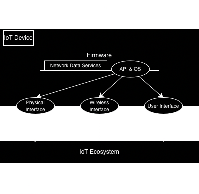

# 2.1. IoT Device Model

This section establishes the foundational IoT device model, providing a structural blueprint of IoT architecture. Developing this model is a prerequisite for our proposed solution approach (see [1. Introduction](../01_introduction/README.md)). Furthermore, this model serves as the structural basis for all subsequent stages of the framework, including [Threat Modeling](./threat_model.md), [Methodology](./methodology.md), and the [Catalogue](../03_catalogue/README.md).

## Device Model Scheme

The device model integrates all previously described components into a unified architecture, as illustrated in the figure below. To maintain clarity, cardinalities are not explicitly shown; however, it should be noted that a single IoT device may contain multiple instances of any given component. 

Unlike existing models that treat sensors and actuators as independent components, this framework classifies them as physical, wireless, or user interfaces. This distinction is made because these elements serve as the primary conduits for interaction between internal device logic and external environments or users.

In scenarios involving nested architectures—where a device contains sub-devices—the classification of an interface as "internal" or "external" is determined by the observer's perspective and the established [Architectural Boundaries](#architectural-boundaries). Ultimately, this specialized model provides a high-fidelity, technology-agnostic method for representing diverse IoT hardware. By focusing strictly on the device’s internal composition, this model enables the development of detailed, standardized test cases applicable to any IoT implementation, regardless of its underlying protocols or standards.

## Architectural Boundaries
To effectively conduct a security assessment, one must first establish the demarcation line between the IoT device and its surrounding ecosystem. For the purposes of this framework, the device boundary is defined by its physical enclosure. This enclosure serves as the literal partition between internal hardware/software elements and external environmental factors.

While interfaces facilitate communication across this boundary, they are not considered part of the enclosure itself. Instead, interfaces are analyzed as distinct entities (refer to [Interfaces](#interfaces)). In this model, any element or interface that can be independently targeted during a penetration test is classified as a "component."

## Components
The device model utilizes a generalized taxonomy of parts known as "components." Each component represents a discrete piece of hardware or software that can be evaluated individually. Consequently, the scope of an IoT security audit is defined by the specific list of components identified for testing.

### Internal Elements
Internal elements are the functional units contained within the device's physical housing. These typically include:

* **Firmware:** The core logic and instruction sets embedded within the hardware. Firmware manages device operations and regulates data flow between internal and external points. It resides in non-volatile memory and is executed by the processor. Potential attack surfaces include the OS, RTOS, or bare-metal implementations.
* **Network Data Services:** These are functional sub-sets of the firmware designed to facilitate data exchange across interfaces (e.g., via network protocols or bus listeners). They act as the software logic for transmitting and receiving information.

*Note: While firmware update packages are critical to security, they are treated as external artifacts that can be analyzed independently; therefore, they are excluded from the "internal element" scope of this guide.*

## Interfaces
Interfaces serve as the bridge between components. If an interface connects at least one internal element to another entity, it is considered within the device's scope. These are categorized by their communication type:

* **Physical (Machine-to-Machine):** Hardwired connections requiring physical access to a port or socket on the enclosure. *Examples: USB, Ethernet.*
* **Wireless (Machine-to-Machine):** Non-contact connections utilizing radio frequencies or optical signals, accessible from a distance. *Examples: Wi-Fi, Bluetooth/BLE, ZigBee.*
* **User Interfaces (Human-to-Machine):** Channels designed for interaction between a human operator and the device. These may be physical (touchscreens) or remote (web applications). *Examples: Microphones, Cameras, Local Web UIs.*
