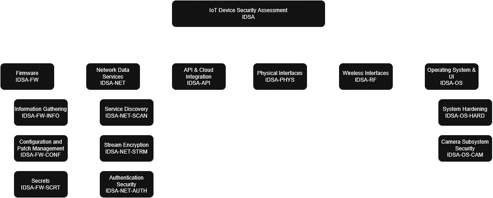

# 2.3. Testing Methodology

In this chapter, a methodology for performing IoT device penetration tests will be described. It is based on the concepts, presented in [2.1. IoT Device Model](./device_model.md) and [2.2. Threat Model](./threat_model.md) and serves as a supplement, which can be used with pre-existing penetration testing workflows and frameworks. The methodology comprises key aspects of testing that have to be performed during an IoT device penetration test. Therefore, it includes a catalog of test cases for each individual device component. As described in the previous chapters, the specific selection of applicable test cases depends on the results of applying the device and threat models, which have been designed in the context of this methodology.

At first, it will be described how this methodology can be integrated into other workflows and during which steps the models and concepts of this methodology can be used. Then, selected testing techniques will be explained, which can be applied during the test and are not restricted to certain test cases. Finally, the structural concept of the catalog of test cases will be explained.

In comparison to other IoT penetration testing frameworks, this methodology follows a more generic yet comprehensive approach. It defines test cases for certain security issues that are relevant in the IoT context (key aspects of testing) without being restricted by the details of specific technologies or standards. Thereby, this methodology is more flexible than other frameworks, which is an important benefit given the volatility of the IoT field. Nonetheless, the methodology is applicable to various technologies and provides possibilities for further particularizations.

It must be noted that test cases, which apply to multiple components, will not be included in this chapter. The full list of test cases can be found in [3. Test Case Catalog](../03_test_cases/README.md).

## Description of the Hierarchic Structure

In the following, the overall structure of the test case catalog as well as the general layout of a test case will be defined.

### Structure of the Catalog of Test Cases

The catalog of test cases will follow a hierarchic (tree) structure. Starting from a single root node (IOT), each component of the device model will be represented as a child node, thereby forming its own subtree. Subsequently, further nodes will be added as children to the component nodes, eventually resulting in each test case being a leaf node. A unique identifier, incorporating this structure, will be assigned to each node, allowing to reference it in the test report or other documents.

The following hierarchic levels and types of nodes are defined:

- **Component:** The first main hierarchy level is the component (see [2.1. IoT Device Model](./device_model.md)). The type of component (device-internal element/interface) was not included in the hierarchy for the sake of simplicity and due to the lack of added value.

  *Short representation: 2 - 5 uppercase alphabetic characters*

  *Examples: IDSA-FW, IDSA-NET, IDSA-INT, IDSA-API, IDSA-RF, IDSA-OS*

- **Category:** The second main hierarchy level is the category, which can be used to group test cases, e.g., all test cases related to authorization can be grouped in the category AUTHZ.

  *Short representation: 2 - 5 uppercase alphabetic characters*

  *Examples: IDSA-\*-AUTHZ, IDSA-\*-INFO, IDSA-\*-CONF*

- **Test Case:** The third main hierarchy level is the test case. See [3. Test Case Catalog](../03_test_cases/README.md) for more details.

  *Short representation: three-digit incremental number of the test case.*

  *Examples: IDSA-FW-*-001, IDSA-FW-*-002, IDSA-FW-*-003*

This kind of structure allows to efficiently determine applicable subtrees by deselecting nodes (e.g., components, component specializations and categories) that are not relevant for a given device or test scenario. The table below shows an exemplary list of nodes for each hierarchy level. An overview of all components and categories that are included in this guide can be seen in the figure below the table.

The usage of component and category specializations allows to expand the catalog of general test cases to include test cases for specific standards and technologies. By inheriting test cases from their parent nodes, it is ensured that these test cases are also applied to the child nodes by default. However, at the time of writing this guide, the possibility that test cases of a parent node might not be applicable to a child node in particular cases could not be precluded. Thus, it is allowed to specify a list of test cases, which are excluded from being inherited by a certain child node.

Another way to expand the catalog is to add custom components, categories and test cases. This way, the methodology could also be expanded to include further components, e.g., device-external elements of the IoT ecosystem.

<table>
    <thead>
        <tr>
            <th>Hierarchy Level</th>
            <th>ID</th>
            <th>Description</th>
        </tr>
    </thead>
    <tbody>
        <tr>
            <td>0</td>
            <td>IOT</td>
            <td>Root Node</td>
        </tr>
        <tr>
            <td rowspan="7" valign="top">1</td>
            <td colspan="2"><b>Component</b></td>
        </tr>
        <tr>
            <td>IDSA-FW</td>
            <td>Firmware</td>
        </tr>
        <tr>
            <td>IDSA-NET</td>
            <td>Network Data Services</td>
        </tr>
        <tr>
            <td>IDSA-API</td>
            <td>API & Cloud Integration</td>
        </tr>
        <tr>
            <td>IDSA-PHYS</td>
            <td>Physical Interfaces</td>
        </tr>
        <tr>
            <td>IDSA-RF</td>
            <td>Wireless Interfaces</td>
        </tr>
        <tr>
            <td>IDSA-OS</td>
            <td>Operating System & UI </td>
        </tr>
        <tr>
            <td rowspan="9" valign="top">2</td>
            <td colspan="2"><b>Category</b></td>
        </tr>
        <tr>
            <td>IDSA-*-INFO</td>
            <td>Information Gathering</td>
        </tr>
         <tr>
            <td>IDSA-*-CONF</td>
            <td>Configuration and Patch Management</td>
        </tr>
        <tr>
            <td>IDSA-*-SCRT</td>
            <td>Secrets</td>
        </tr>
        <tr>
            <td>IDSA-*-SCAN</td>
            <td>Service Discovery</td>
        </tr>
        <tr>
            <td>IDSA-*-STRM</td>
            <td>Stream Encryption</td>
        </tr>
        <tr>
            <td>IDSA-*-AUTH</td>
            <td>Authentication Security</td>
        </tr>
        <tr>
            <td>IDSA-*-HARD</td>
            <td>System Hardening</td>
        </tr>
        <tr>
            <td>IDSA-*-CAM</td>
            <td>Camera Subsystem Security</td>
        </tr>
    </tbody>
</table>

## IoT Vulnerability Severity Reference (CVSS v3.1/v4.0)

This table defines how Common Vulnerability Scoring System (CVSS) scores are interpreted specifically for IoT environments, where factors like physical access and firmware update constraints may increase risk.

| Score Range | Severity Level | General Impact Description | IoT-Specific Context & Risk Factors |
| :---: | :---: | :--- | :--- |
| **0.0 – 3.9** | **Low** | Minor impact; often requires specific conditions or local access to exploit. | • Firmware update failure • UI/UX glitches • Local-only privilege escalation (e.g., via USB) • *IoT Risk:* Low unless device is in a high-traffic network segment. |
| **4.0 – 6.9** | **Medium** | Moderate impact; may allow remote denial-of-service or limited data exfiltration. | • Remote DoS (e.g., buffer overflow) • Limited RCE with restricted payload • *IoT Risk:* Medium if device is connected to a LAN that shares resources with critical infrastructure. |
| **7.0 – 8.9** | **High** | Significant impact; potential for remote code execution or persistent access. | • Remote Code Execution (RCE) • Physical access compromise • *IoT Risk:* High if device controls physical actuators, cameras, or sensors. • *Patching:* Difficult due to constrained resources. |
| **9.0 – 10.0** | **Critical** | Massive impact; full system takeover or safety-critical failure. | • Full Device Hijack (Botnet recruitment) • Safety-Critical Failure (e.g., medical, industrial control) • *IoT Risk:* Critical if device bridges secure networks to the internet. • *Patching:* Often requires hardware replacement. |

### Key Considerations for IoT Scoring
1.  **Attack Surface:** A "Medium" score on a smart thermostat is less risky than a "Medium" score on an industrial PLC (Programmable Logic Controller).
2.  **Update Mechanism:** Devices with no OTA (Over-The-Air) update capability may require hardware replacement for High/Critical fixes, effectively raising the business severity.
3.  **Physical Proximity:** Vulnerabilities requiring physical access are often scored lower in IoT contexts unless the device is easily accessible to an attacker.
4.  **Versioning:** Always check if your firmware version matches the CVSS metadata (e.g., CVE-202X-XXXX).

> **Note:** This table aligns with NIST and ISO/IEC standards for IoT risk management. For detailed metric breakdowns, refer to the [NVD](https://nvd.nist.gov/) or vendor-specific advisories.

### Structure of Test Cases

Each individual test case, which is represented by a leaf node, is divided into the following sections:

-   **Test ID:** A unique identifier assigned to each specific security check (e.g., IOT-001). This allows for precise referencing within reports or automated scanning tools.

-   **Test Name:** A descriptive title of the security check being performed (e.g., "Default Password Verification").

-   **Status:** The current state of the test execution, such as Pending, In Progress, Passed (vulnerable), Failed (secure), or N/A. This helps testers track progress and identify which checks require immediate attention.

-   **Severity:** An assessment of the potential impact if the vulnerability is exploited, typically aligned with the Common Vulnerability Scoring System (e.g., High, Medium, Low). If a numeric score is used, it should follow CVSS v3.1 or v4.0 standards.

-   **Notes:** Additional context regarding specific implementation details, environmental dependencies, prerequisites, or observations made during the test execution that are not covered in the primary sections.

[bsi_pentest]: https://www.bsi.bund.de/SharedDocs/Downloads/EN/BSI/Publications/Studies/Penetration/penetration_pdf.pdf?__blob=publicationFile&v=1	"Study: A Penetration Testing Model"
[nvd]: https://nvd.nist.gov	"National Vulnerability Database"
[owasp_fuzzing]: https://owasp.org/www-community/Fuzzing	"Fuzzing"
