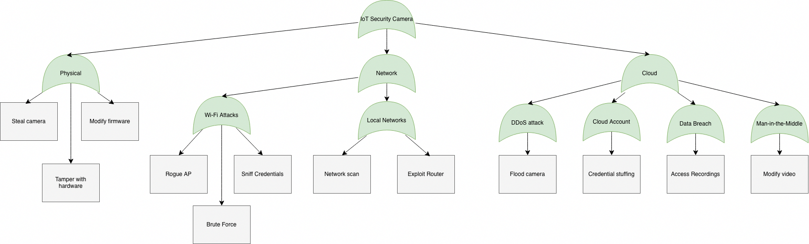

# 2.2. Threat Model
In this chapter, a selection scheme for test cases will be described, which is based on potential threats identified through a formal threat and risk modeling approach, specifically tailored to the IoT camera being tested in this framework. In alignment with models such as STRIDE, the threat model used in this guide provides a structured framework for defining and selecting threats relevant to the specific architecture and data flows of an IoT camera device.

The rationale for adopting a formal threat and risk modeling is:

-   **Architecture-Specific Depth:** Formal threat and risk modeling allows for a deep analysis of the specific implementation design of the IoT camera. Since cameras often involve complex subsystems (e.g., video encoding, audio processing, local storage, and network interfaces), identified threats are based on precise conditions of the solution, ensuring that high-value risks associated with media streams and persistent connectivity are not overlooked.

-   **Risk Justification:** While performing a formal threat and risk analysis requires more time, this investment is justified for an IoT camera due to its critical nature as a network-facing device handling sensitive visual data. Making a formal analysis the standard requirement ensures comprehensive coverage of attack vectors without significantly increasing expenses per test beyond acceptable limits for high-risk hardware.

-   **Scope and Access Definition:** As will be explained in following sections, the spectrum of potential threats reaches from anonymous global actors to privileged individuals and users of the device. The list of threats can be narrowed down by defining minimum and maximum access requirements, representing the test perspective. Every device component and test case will be tagged with the access level required to perform the respective tests. Hence, the list of device components in scope of the test as well as the list of applicable test cases will be a result of applying the formal threat model on the results yielded by the device model.

## Attack Vectors

[cvss]: https://www.first.org/cvss/	"Common Vulnerability Scoring System"
